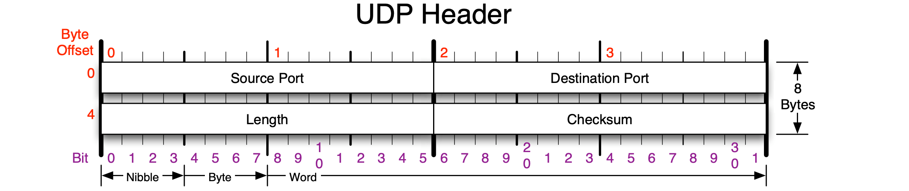

# UDP
{: .no_toc }

## Table of Contents
{: .no_toc .text-delta }

1. TOC
{:toc}

## UDP: segment header

- PDF: [UDP & ICMP Headers](https://www.cs.nmt.edu/~risk/UDP_ICMP_Headers.pdf)



- fixed bytes: 8 bytes

---

- TXT: [RFC768](http://ftp.cerias.purdue.edu/pub/doc/rfc/rfc768.txt)

```
Format
------

                                    
                  0      7 8     15 16    23 24    31  
                 +--------+--------+--------+--------+ 
                 |     Source      |   Destination   | 
                 |      Port       |      Port       | 
                 +--------+--------+--------+--------+ 
                 |                 |                 | 
                 |     Length      |    Checksum     | 
                 +--------+--------+--------+--------+ 
                 |                                     
                 |          data octets ...            
                 +---------------- ...                 

                      User Datagram Header Format
```

---

## 题目

### Q1

已知某UDP数据报的首部信息（以十六进制形式表示）为 `0xF7 21 00 45 00 2C E8 27`。根据UDP数据报的格式，回答以下问题：

1. **源端口号是多少？**
2. **目的端口号是多少？**
3. **数据报的总长度是多少？**
4. **数据部分的长度是多少？**
5. **该UDP数据报是从客户端发送给服务器端还是从服务器端发送给客户端？使用该UDP服务的应用层协议是什么？**

### A1

UDP首部由四部分组成：源端口（16位）、目的端口（16位）、长度（16位）、校验和（16位）。现将UDP首部字段逐一解析。

#### 1. 源端口号

首部前两字节为 `F7 21`，即十六进制的 `0xF721`。

将其转换为十进制：

\[
F7 21_{16} = 63265_{10}
\]

因此，源端口号为 **63265**。

#### 2. 目的端口号

首部的第三、四字节为 `00 45`，即十六进制的 `0x0045`。

将其转换为十进制：

\[
00 45_{16} = 69_{10}
\]

因此，目的端口号为 **69**。

#### 3. 数据报总长度

首部的第五、六字节为 `00 2C`，即十六进制的 `0x002C`。

将其转换为十进制：

\[
00 2C_{16} = 44_{10}
\]

根据UDP协议的定义，长度字段包括UDP首部和数据部分的总长度。因此，UDP数据报的总长度为 **44字节**。

#### 4. 数据部分长度

UDP首部的固定长度为8字节。数据部分长度可以通过以下公式计算：

\[
数据部分长度 = 数据报总长度 - UDP首部长度 = 44 - 8 = 36 \, \text{字节}
\]

因此，数据部分长度为 **36字节**。

#### 5. UDP数据报的发送方向和应用层协议

从端口号推断数据报的发送方向。目的端口号 `69` 对应的是**TFTP（Trivial File Transfer Protocol，简单文件传输协议）**，这是一个常用于网络设备的简单文件传输服务，通常运行在服务器端。

根据源端口号和目的端口号的使用惯例，通常高位端口（如 `63265`）被客户端动态分配，而低位端口（如 `69`）是服务器端使用的标准端口。因此，该数据报是**从客户端发送给服务器端的**，并且使用的是**TFTP协议**。

#### 总结

1. 源端口号：**63265**
2. 目的端口号：**69**
3. 数据报总长度：**44字节**
4. 数据部分长度：**36字节**
5. 该UDP数据报是**从客户端发送给服务器端**的，使用的应用层协议为**TFTP**。

---

Last Updated: Thu Oct 17 22:37:06 CST 2024


